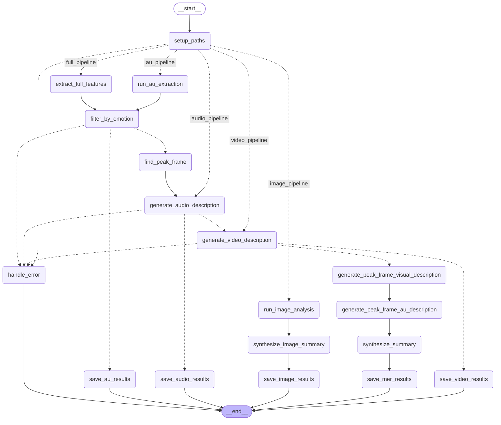

# 👉🏻 MER-Factory 👈🏻
<p align="left">
        <a href="README_zh.md">中文</a> &nbsp｜ &nbsp English&nbsp&nbsp
</p>
<br>

<p align="center">
  <strong>Your automated factory for constructing Multimodal Emotion Recognition and Reasoning (MERR) datasets.</strong>
</p>
<p align="center">
  <a href="https://lum1104.github.io/MER-Factory/" target="_blank">📖 Documentation</a>
</p>

<p align="center">    </p>

<!-- <p align="center">  </p> -->

<p align="center">
  <a href="https://lum1104.github.io/MER-Factory/">
    
  </a>
</p>

## Table of Contents

- [Pipeline Structure](#pipeline-structure)
- [Features](#features)
- [Prerequisites](#prerequisites)
  - [1. FFmpeg](#1-ffmpeg)
  - [2. OpenFace](#2-openface)
- [Installation](#installation)
- [Usage](#usage)
  - [Basic Command Structure](#basic-command-structure)
  - [Examples](#examples)
  - [Command Line Options](#command-line-options)
  - [Processing Types](#processing-types)
- [Model Support](#model-support)
  - [Model Recommendations](#model-recommendations)
- [Testing & Troubleshooting](#testing--troubleshooting)
- [Citation](#citation)


## Pipeline Structure

<details>
<summary>Click here to expand/collapse</summary>




</details>

## Features

-   **Action Unit (AU) Pipeline**: Extracts facial Action Units (AUs) and translates them into descriptive natural language.
-   **Audio Analysis Pipeline**: Extracts audio, transcribes speech, and performs detailed tonal analysis.
-   **Video Analysis Pipeline**: Generates comprehensive descriptions of video content and context.
-   **Image Analysis Pipeline**: Provides end-to-end emotion recognition for static images, complete with visual descriptions and emotional synthesis.
-   **Full MER Pipeline**: An end-to-end multimodal pipeline that identifies peak emotional moments, analyzes all modalities (visual, audio, facial), and synthesizes a holistic emotional reasoning summary.

Check out example outputs here:
-   [llava-llama3:latest_llama3.2_merr_data.json](examples/llava-llama3:latest_llama3.2_merr_data.json)
-   [gemini_merr.json](examples/gemini_merr.json)

## Prerequisites

### 1. FFmpeg
FFmpeg is required for video and audio processing.

<details>
<summary>Click here to expand/collapse</summary>

**Installation:**
- **macOS**: `brew install ffmpeg`
- **Ubuntu/Debian**: `sudo apt update && sudo apt install ffmpeg`
- **Windows**: Download from [ffmpeg.org](https://ffmpeg.org/download.html)

**Verify installation:**
```bash
ffmpeg -version
ffprobe -version
```

</details>

### 2. OpenFace
OpenFace is needed for facial Action Unit extraction.

<details>
<summary>Click here to expand/collapse</summary>

**Installation:**
1. Clone OpenFace repository:
   ```bash
   git clone https://github.com/TadasBaltrusaitis/OpenFace.git
   cd OpenFace
   ```

2. Follow the installation instructions for your platform from the [OpenFace Wiki](https://github.com/TadasBaltrusaitis/OpenFace/wiki)

3. Build the project and note the path to the `FeatureExtraction` executable (typically in `build/bin/FeatureExtraction`)

</details>

## Installation

```bash
git clone https://github.com/Lum1104/MER-Factory.git
cd MER-Factory

conda create -n mer-factory python=3.12
conda activate mer-factory

pip install -r requirements.txt
```

**Configuration:**
1. Copy the example environment file:
   ```bash
   cp .env.example .env
   ```

2. Edit the `.env` file and configure your settings:
   - `GOOGLE_API_KEY`: Your Google API key for Gemini models (optional if using other models)
   - `OPENAI_API_KEY`: Your OpenAI API key for ChatGPT models (optional if using other models)
   - `OPENFACE_EXECUTABLE`: Path to OpenFace FeatureExtraction executable (required for AU and MER pipelines)

## Usage

### Basic Command Structure
```bash
python main.py [INPUT_PATH] [OUTPUT_DIR] [OPTIONS]
```

### Examples
```bash
# Show all supported args.
python main.py --help

# Full MER pipeline with Gemini (default)
python main.py path_to_video/ output/ --type MER --silent --threshold 0.8

# Using ChatGPT models
python main.py path_to_video/ output/ --type MER --chatgpt-model gpt-4o --silent

# Using local Ollama models
python main.py path_to_video/ output/ --type MER --ollama-vision-model llava-llama3:latest --ollama-text-model llama3.2 --silent

# Using Hugging Face model
python main.py path_to_video/ output/ --type MER --huggingface-model google/gemma-3n-E4B-it --silent

# Process images instead of videos
python main.py ./images ./output --type MER
```

Note: Run `ollama pull llama3.2` etc, if Ollama model is needed. Ollama does not support video analysis for now.

### Command Line Options

| Option | Short | Description | Default |
|--------|-------|-------------|---------|
| `--type` | `-t` | Processing type (AU, audio, video, image, MER) | MER |
| `--label-file` | `-l` | Path to a CSV file with 'name' and 'label' columns. Optional, for ground truth labels. | None |
| `--threshold` | `-th` | Emotion detection threshold (0.0-5.0) | 0.8 |
| `--peak_dis` | `-pd` | Steps between peak frame detection (min 8) | 15 |
| `--silent` | `-s` | Run with minimal output | False |
| `--cache` | `-ca` | Reuse existing audio/video/AU results from previous pipeline runs | False |
| `--concurrency` | `-c` | Concurrent files for async processing (min 1) | 4 |
| `--ollama-vision-model` | `-ovm` | Ollama vision model name | None |
| `--ollama-text-model` | `-otm` | Ollama text model name | None |
| `--chatgpt-model` | `-cgm` | ChatGPT model name (e.g., gpt-4o) | None |
| `--huggingface-model` | `-hfm` | Hugging Face model ID | None |

### Processing Types

#### 1. Action Unit (AU) Extraction
Extracts facial Action Units and generates natural language descriptions:
```bash
python main.py video.mp4 output/ --type AU
```

#### 2. Audio Analysis
Extracts audio, transcribes speech, and analyzes tone:
```bash
python main.py video.mp4 output/ --type audio
```

#### 3. Video Analysis
Generates comprehensive video content descriptions:
```bash
python main.py video.mp4 output/ --type video
```

#### 4. Image Analysis
Runs the pipeline with image input:
```bash
python main.py ./images ./output --type image
# Note: Image files will automatically use image pipeline regardless of --type setting
```

#### 5. Full MER Pipeline (Default)
Runs the complete multimodal emotion recognition pipeline:
```bash
python main.py video.mp4 output/ --type MER
# or simply:
python main.py video.mp4 output/
```

## Model Support

The tool supports four types of models:

1. **Google Gemini** (default): Requires `GOOGLE_API_KEY` in `.env`
2. **OpenAI ChatGPT**: Requires `OPENAI_API_KEY` in `.env`, specify with `--chatgpt-model`
3. **Ollama**: Local models, specify with `--ollama-vision-model` and `--ollama-text-model`
4. **Hugging Face**: Currently supports multimodal models like `google/gemma-3n-E4B-it`

**Note**: If using Hugging Face models, concurrency is automatically set to 1 for synchronous processing.

### Model Recommendations

#### When to Use Ollama
**Recommended for**: Image analysis, Action Unit analysis, text processing, and simple audio transcription tasks.

**Benefits**:
- ✅ **Async support**: Ollama supports asynchronous calling, making it ideal for processing large datasets efficiently
- ✅ **Local processing**: No API costs or rate limits
- ✅ **Wide model selection**: Visit [ollama.com](https://ollama.com/) to explore available models
- ✅ **Privacy**: All processing happens locally

**Example usage**:
```bash
# Process images with Ollama
python main.py ./images ./output --type image --ollama-vision-model llava-llama3:latest --ollama-text-model llama3.2 --silent

# AU extraction with Ollama
python main.py video.mp4 output/ --type AU --ollama-text-model llama3.2 --silent
```

#### When to Use ChatGPT/Gemini
**Recommended for**: Advanced video analysis, complex multimodal reasoning, and high-quality content generation.

**Benefits**:
- ✅ **State-of-the-art performance**: Latest GPT-4o and Gemini models offer superior reasoning capabilities
- ✅ **Advanced video understanding**: Better support for complex video analysis and temporal reasoning
- ✅ **High-quality outputs**: More nuanced and detailed emotion recognition and reasoning
- ✅ **Robust multimodal integration**: Excellent performance across text, image, and video modalities

**Example usage**:
```bash
python main.py video.mp4 output/ --type MER --chatgpt-model gpt-4o --silent

python main.py video.mp4 output/ --type MER --silent
```

**Trade-offs**: API costs and rate limits, but typically provides the highest quality results for complex emotion reasoning tasks.

#### When to Use Hugging Face Models
**Recommended for**: When you need the latest state-of-the-art models or specific features not available in Ollama.

**Custom Model Integration**:
If you want to use the latest HF models or features that Ollama doesn't support:

1. **Option 1 - Implement yourself**: Navigate to `agents/models/hf_models/__init__.py` to register your own model and implement the needed functions following our existing patterns.

2. **Option 2 - Request support**: Open an issue on our repository to let us know which model you'd like us to support, and we'll consider adding it.

**Current supported models**: `google/gemma-3n-E4B-it` and others listed in the HF models directory.

## Testing & Troubleshooting

### Installation Verification
Use these scripts to ensure your dependencies are correctly configured.

<details>
<summary>Click to see testing commands</summary>

**Test FFmpeg Integration**:
```bash
python test_ffmpeg.py your_video.mp4 test_output/
```

**Test OpenFace Integration**:
```bash
python test_openface.py your_video.mp4 test_output/
```

</details>

### Common Issues

1.  **FFmpeg not found**:
    -   **Symptom**: `FileNotFoundError` related to `ffmpeg` or `ffprobe`.
    -   **Solution**: Ensure FFmpeg is installed correctly and that its location is included in your system's `PATH` environment variable. Verify with `ffmpeg -version`.

2.  **OpenFace executable not found**:
    -   **Symptom**: Errors indicating the `FeatureExtraction` executable cannot be found.
    -   **Solution**: Double-check the `OPENFACE_EXECUTABLE` path in your `.env` file. It must be an **absolute path** to the executable. Ensure the file has execute permissions (`chmod +x FeatureExtraction`).

3.  **API Key Errors (Google/OpenAI)**:
    -   **Symptom**: `401 Unauthorized` or `PermissionDenied` errors.
    -   **Solution**: Verify that the API keys in your `.env` file are correct and do not have extra spaces or characters. Ensure the associated account has billing enabled and sufficient quota.

4.  **Ollama Model Not Found**:
    -   **Symptom**: Errors mentioning the model is not available.
    -   **Solution**: Make sure you have pulled the model locally using `ollama pull <model_name>`.

## Citation

If you find MER-Factory useful in your research or project, please consider citing us:

```bibtex
@software{Lin_MER-Factory_2025,
  author = {Lin, Yuxiang},
  doi = {10.5281/zenodo.15847351},
  license = {MIT},
  month = {7},
  title = {{MER-Factory}},
  url = {https://lum1104.github.io/MER-Factory/},
  version = {0.1.0},
  year = {2025}
}
```
