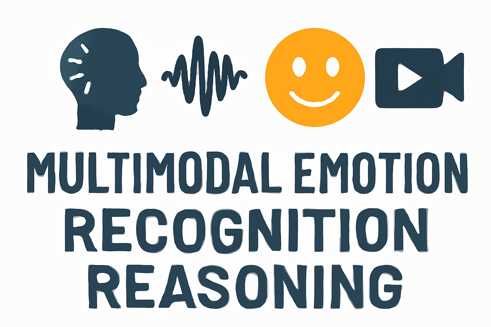
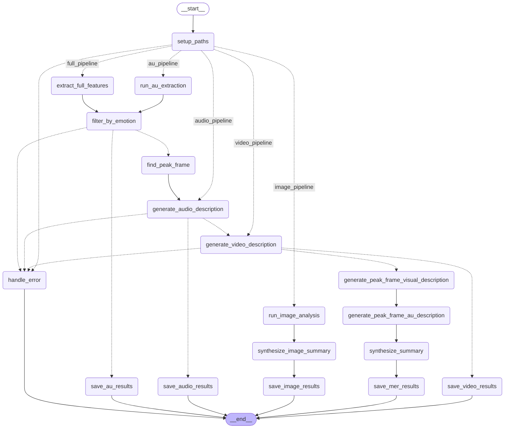

# 👉🏻 MER-Factory 👈🏻

<p align="left">
        中文</a>&nbsp ｜ &nbsp<a href="README.md">English</a>
</p>
<br>

<p align="center">
  <strong>您的多模态情感识别与推理（MERR）数据集自动化工厂。</strong>
</p>
<p align="center">
  <a href="https://lum1104.github.io/MER-Factory/" target="_blank">📖 项目文档</a>
</p>

<p align="center">    </p>

<!-- <p align="center">  </p> -->

<p align="center">
  <a href="https://lum1104.github.io/MER-Factory/">
    
  </a>
</p>

## 目录

- [Pipeline 结构](#pipeline-结构)
- [特性](#特性)
- [前置条件](#前置条件)
  - [1. FFmpeg](#1-ffmpeg)
  - [2. OpenFace](#2-openface)
- [安装](#安装)
- [使用方法](#使用方法)
  - [基本命令结构](#基本命令结构)
  - [示例](#示例)
  - [命令行选项](#命令行选项)
  - [处理类型](#处理类型)
- [模型支持](#模型支持)
  - [模型推荐](#模型推荐)
- [测试与故障排除](#测试与故障排除)
- [技术文档](#技术文档)

## Pipeline 结构

<details>
<summary>点击展开/折叠</summary>



</details>

## 特性

-   **动作单元（AU）处理流程**：提取面部动作单元（AUs），并将其翻译成描述性的自然语言。
-   **音频分析处理流程**：提取音频，转录语音，并进行详细的音调分析。
-   **视频分析处理流程**：生成视频内容和上下文的全面描述。
-   **图像分析处理流程**：为静态图像提供端到端的情感识别，包括视觉描述和情感合成。
-   **完整 MER 处理流程**：端到端的多模态处理流程，识别情感峰值时刻，分析所有模态（视觉、音频、面部），并合成一个整体的情感推理总结。

查看示例输出：
-   [llava-llama3:latest_llama3.2_merr_data.json](examples/llava-llama3:latest_llama3.2_merr_data.json)
-   [gemini_merr.json](examples/gemini_merr.json)

## 前置条件

### 1. FFmpeg
FFmpeg 用于视频和音频处理。

<details>
<summary>点击展开/折叠</summary>

**安装方法：**
- **macOS**：`brew install ffmpeg`
- **Ubuntu/Debian**：`sudo apt update && sudo apt install ffmpeg`
- **Windows**：从 [ffmpeg.org](https://ffmpeg.org/download.html) 下载

**验证安装：**
```bash
ffmpeg -version
ffprobe -version
```

</details>

### 2. OpenFace
OpenFace 用于面部动作单元提取。

<details>
<summary>点击展开/折叠</summary>

**安装方法：**
1. 克隆 OpenFace 仓库：
   ```bash
   git clone https://github.com/TadasBaltrusaitis/OpenFace.git
   cd OpenFace
   ```

2. 按照 [OpenFace Wiki](https://github.com/TadasBaltrusaitis/OpenFace/wiki) 的说明进行安装。

3. 构建项目并记录 `FeatureExtraction` 可执行文件的路径（通常在 `build/bin/FeatureExtraction`）

</details>

## 安装

```bash
git clone https://github.com/Lum1104/MER-Factory.git
cd MER-Factory

conda create -n mer-factory python=3.12
conda activate mer-factory

pip install -r requirements.txt
```

**配置：**
1. 复制示例环境文件：
   ```bash
   cp .env.example .env
   ```

2. 编辑 `.env` 文件并配置您的设置：
   - `GOOGLE_API_KEY`：您的 Google API 密钥（如果使用 Gemini 模型则需要）
   - `OPENAI_API_KEY`：您的 OpenAI API 密钥（如果使用 ChatGPT 模型则需要）
   - `OPENFACE_EXECUTABLE`：OpenFace FeatureExtraction 可执行文件的路径（AU 和 MER 处理流程需要）

## 使用方法

### 基本命令结构
```bash
python main.py [输入路径] [输出目录] [选项]
```

### 示例
```bash
# 查看所有支持功能
python main.py --help

# 使用 Gemini（默认）运行完整 MER 处理流程
python main.py path_to_video/ output/ --type MER --silent --threshold 0.8

# 使用 ChatGPT 模型
python main.py path_to_video/ output/ --type MER --chatgpt-model gpt-4o --silent

# 使用本地 Ollama 模型
python main.py path_to_video/ output/ --type MER --ollama-vision-model llava-llama3:latest --ollama-text-model llama3.2 --silent

# 使用 Hugging Face 模型
python main.py path_to_video/ output/ --type MER --huggingface-model google/gemma-3n-E4B-it --silent

# 处理图像而不是视频
python main.py ./images ./output --type MER
```

注意：如果需要使用 Ollama 模型，请运行 `ollama pull llama3.2` 等命令预先下载模型。Ollama 目前不支持视频分析。

### 命令行选项

| 选项 | 简写 | 描述 | 默认值 |
|--------|-------|-------------|---------|
| `--type` | `-t` | 处理类型（AU、audio、video、image、MER） | MER |
| `--label-file` | `-l` | CSV 文件路径，包含 'name' 和 'label' 列。可选，用于真实标签。 | None |
| `--threshold` | `-th` | 情感检测阈值（0.0-5.0） | 0.8 |
| `--peak_dis` | `-pd` | 情感峰值帧检测间隔（最小 8） | 15 |
| `--silent` | `-s` | 以最小输出运行 | False |
| `--cache` | `-ca` | 复用现有 音视频/ AU 分析结果 | False |
| `--concurrency` | `-c` | 异步处理文件数量（最小 1） | 4 |
| `--ollama-vision-model` | `-ovm` | Ollama 视觉模型名称 | None |
| `--ollama-text-model` | `-otm` | Ollama 文本模型名称 | None |
| `--chatgpt-model` | `-cgm` | ChatGPT 模型名称（例如 gpt-4o） | None |
| `--huggingface-model` | `-hfm` | Hugging Face 模型 ID | None |

### 处理类型

#### 1. 动作单元（AU）提取
提取面部动作单元并生成自然语言描述：
```bash
python main.py video.mp4 output/ --type AU
```

#### 2. 音频分析
提取音频，转录语音并分析音调：
```bash
python main.py video.mp4 output/ --type audio
```

#### 3. 视频分析
生成视频内容的全面描述：
```bash
python main.py video.mp4 output/ --type video
```

#### 4. 图像分析
使用图像输入运行处理流程：
```bash
python main.py ./images ./output --type image
# 注意：图像文件将自动使用图像处理流程，无论 --type 设置为何值
```

#### 5. 完整 MER 处理流程（默认）
运行完整的多模态情感识别处理流程：
```bash
python main.py video.mp4 output/ --type MER
# 或者简单地：
python main.py video.mp4 output/
```

## 模型支持

该工具支持四种类型的模型：

1. **Google Gemini**（默认）：需要在 `.env` 中配置 `GOOGLE_API_KEY`
2. **OpenAI ChatGPT**：需要在 `.env` 中配置 `OPENAI_API_KEY`，通过 `--chatgpt-model` 指定
3. **Ollama**：本地模型，通过 `--ollama-vision-model` 和 `--ollama-text-model` 指定
4. **Hugging Face**：目前支持类似 `google/gemma-3n-E4B-it` 的多模态模型

**注意**：如果使用 Hugging Face 模型，会自动将并发设置为 1，以实现同步处理。

### 模型推荐

#### 何时使用 Ollama
**推荐用途**：图像分析、动作单元分析、文本处理以及简单的音频转录任务。

**优势**：
- ✅ **支持异步调用**：Ollama 支持异步调用，非常适合高效处理大型数据集
- ✅ **本地处理**：无需 API 成本或速率限制
- ✅ **丰富的模型选择**：访问 [ollama.com](https://ollama.com/) 了解可用模型
- ✅ **隐私保护**：所有处理都在本地完成

**示例用法**：
```bash
# 使用 Ollama 处理图像
python main.py ./images ./output --type image --ollama-vision-model llava-llama3:latest --ollama-text-model llama3.2 --silent

# 使用 Ollama 进行 AU 提取
python main.py video.mp4 output/ --type AU --ollama-text-model llama3.2 --silent
```

#### 何时使用 ChatGPT/Gemini
**推荐用途**：高级视频分析、复杂的多模态推理以及高质量内容生成。

**优势**：
- ✅ **最先进的性能**：最新的 GPT-4o 和 Gemini 模型提供卓越的推理能力
- ✅ **高级视频理解**：对复杂视频分析和时间推理支持更好
- ✅ **高质量输出**：更细致、更详细的情感识别和推理
- ✅ **强大的多模态集成**：在文本、图像和视频模态上表现优异

**示例用法**：
```bash
python main.py video.mp4 output/ --type MER --chatgpt-model gpt-4o --silent

python main.py video.mp4 output/ --type MER --silent
```

**权衡**：存在 API 成本和速率限制，但通常为复杂的情感推理任务提供最高质量的结果。

#### 何时使用 Hugging Face 模型
**推荐用途**：当您需要最新的最先进的模型或 Ollama 不支持的特定功能时。

**自定义模型集成**：
如果您想使用最新的 Hugging Face 模型或 Ollama 不支持的功能：

1. **选项 1 - 自行实现**：导航至 `agents/models/hf_models/__init__.py`，按照现有模式注册您的模型并实现所需功能。

2. **选项 2 - 请求支持**：在我们的仓库中提交问题，告诉我们您希望我们支持的模型，我们会考虑添加。

**当前支持的模型**：`google/gemma-3n-E4B-it` 以及其他在 HF 模型目录中列出的模型。

## 测试与故障排除

### 安装验证
使用这些脚本确保您的依赖项正确配置。

<details>
<summary>点击查看测试命令</summary>

**测试 FFmpeg 集成**：
```bash
python test_ffmpeg.py your_video.mp4 test_output/
```

**测试 OpenFace 集成**：
```bash
python test_openface.py your_video.mp4 test_output/
```

</details>

### 常见问题

1.  **未找到 FFmpeg**：
    -   **症状**：出现与 `ffmpeg` 或 `ffprobe` 相关的 `FileNotFoundError`。
    -   **解决方案**：确保 FFmpeg 已正确安装，并且其位置已包含在系统的 `PATH` 环境变量中。通过 `ffmpeg -version` 进行验证。

2.  **OpenFace 可执行文件未找到**：
    -   **症状**：出现错误，提示无法找到 `FeatureExtraction` 可执行文件。
    -   **解决方案**：双检查 `.env` 文件中的 `OPENFACE_EXECUTABLE` 路径。它必须是可执行文件的 **绝对路径**。确保文件具有执行权限（`chmod +x FeatureExtraction`）。

3.  **API 密钥错误（Google/OpenAI）**：
    -   **症状**：出现 `401 Unauthorized` 或 `PermissionDenied` 错误。
    -   **解决方案**：验证 `.env` 文件中的 API 密钥是否正确，且没有多余的空格或字符。确保相关账户已启用计费功能并有足够的配额。

4.  **Ollama 模型未找到**：
    -   **症状**：错误提示模型不可用。
    -   **解决方案**：确保您已使用 `ollama pull <model_name>` 命令将模型下载到本地。

