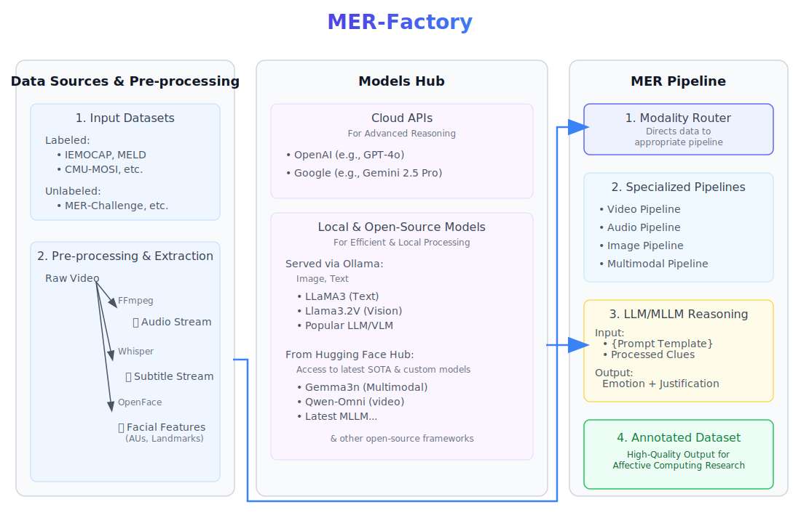

# MER-Factory: Technical Documentation

## 1. Introduction & System Overview

MER-Factory is a Python-based, open-source framework for the Affective Computing community, designed to create unified datasets for training Multimodal Large Language Models (MLLMs). Initially conceived for processing full multimodal video, the tool has evolved to also support single-modality analysis (e.g., image or audio annotation). It automates the extraction of multimodal features (facial, audio, visual) and leverages LLMs to generate detailed analyses and emotional reasoning summaries.

The framework supports two primary annotation workflows:
1.  **Unsupervised (No Label):** The tool analyzes the media and generates descriptions and emotion data from scratch.
2.  **Supervised (Label Provided):** By providing a ground truth label via the `--label-file` argument, the tool can perform more targeted analysis, focusing on generating a rationale or explanation for why a specific emotion occurs.

The system is built with modularity and scalability in mind, leveraging a state-driven graph architecture (`langgraph`) to manage complex processing workflows. This allows for flexible pipeline execution, from simple single-modality analysis to a full, end-to-end multimodal synthesis, providing an easy-to-use and open framework for dataset construction.

### Core Technologies
-   **CLI Framework:** `Typer` for a clean and robust command-line interface.
-   **Workflow Management:** `LangGraph` to define and execute the processing pipelines as a stateful graph.
-   **Facial Analysis:** `OpenFace` for extracting Facial Action Units (AUs).
-   **Media Processing:** `FFmpeg` for audio/video manipulation (extraction, frame grabbing).
-   **AI/LLM Integration:** Pluggable architecture supporting `OpenAI (ChatGPT)`, `Google (Gemini)`, `Ollama` (local models), and `Hugging Face` models.
-   **Data Handling:** `pandas` for processing tabular AU data.
-   **Concurrency:** `asyncio` for efficient, parallel processing of multiple files.

## System Overview

<div style="text-align: center;">
  
</div>

---

## 2. System Architecture & Execution Flow

The application's execution is orchestrated from `main.py`, which serves as the entry point. The core logic is structured into two main phases managed by the `main_orchestrator` function.

1.  **Phase 1: Feature Extraction:** This preliminary phase runs concurrently for all input files. It uses external tools (`FFmpeg`, `OpenFace`) to extract the raw features needed for the main analysis. This includes extracting audio streams to `.wav` files and running OpenFace to generate `.csv` files containing frame-by-frame AU data. This is handled by `utils.processing_manager.run_feature_extraction`.

2.  **Phase 2: Main Processing:** This phase executes the main analysis pipeline using a `langgraph` computational graph. The graph processes each file individually, passing a state object through a series of nodes that perform specific tasks. This is handled by `utils.processing_manager.run_main_processing`.

### 2.1. State Management (`state.py`)

The entire processing pipeline is stateful. The `MERRState` class (a `TypedDict` with `total=False`) acts as a central data carrier that is passed between nodes in the graph. The use of `total=False` is critical, as it allows the state to be valid even when only partially populated, which is essential for an incrementally-built state that flows through different pipeline branches.

Each node can read from and write to this state dictionary. This design decouples nodes from each other, as they only need to know about the state object, not the nodes that come before or after.

**Key fields in `MERRState` are grouped as follows:**
-   **Core Configuration:** `processing_type`, `models`, `verbose`, `cache`, `ground_truth_label`.
-   **Path Management:** `video_path`, `video_id`, `output_dir`, `audio_path`, `au_data_path`, `peak_frame_path`.
-   **Facial Analysis Parameters & Results:** `threshold`, `peak_distance_frames`, `detected_emotions`, `peak_frame_info`.
-   **Intermediate LLM Descriptions:** `audio_analysis_results`, `video_description`, `image_visual_description`, `peak_frame_au_description`, `llm_au_description`.
-   **Final Outputs:** `final_summary`, `error`.

### 2.2. The Computational Graph (`graph.py`)

The heart of the application is the `StateGraph` defined in `create_graph`. This graph defines the possible paths of execution for the different processing types.

-   **Nodes:** Each node is a Python function that performs a specific, atomic action (e.g., `generate_audio_description`). The framework supports both `async` and `sync` nodes. This dual support is crucial because while API-based models (Gemini, OpenAI, Ollama) benefit from `asyncio` for high concurrency, some libraries, particularly for local Hugging Face models, operate synchronously. The graph dynamically loads the correct node type based on the selected model.
-   **Edges:** Edges connect the nodes, defining the flow of control.
-   **Conditional Edges:** The graph uses router functions (`route_by_processing_type`, etc.) to dynamically decide the next step based on the current `MERRState`. This is the mechanism that enables the tool to run different pipelines (e.g., 'AU' vs. 'MER') within the same graph structure.

### 2.3. Configuration, Caching, and Error Handling

-   **Configuration (`utils/config.py`):** The `AppConfig` dataclass centralizes all configurations derived from CLI arguments and `.env` variables. It acts as a single source of truth that is passed to the orchestrator, validating inputs (e.g., checking that a model choice is valid) before processing begins.
-   **Error Handling:** Errors within a graph node do not crash the entire application. Instead, a node catches its own exceptions and places an error message into the `error` field of the `MERRState`. Subsequent routing functions check for the presence of this field and direct the flow to a terminal `handle_error` node, allowing the application to gracefully terminate processing for one file and move on to the next.

---

## 3. Core Modules & Functionality

### 3.1. Command-Line Interface (`main.py`)

The CLI, defined using `Typer`, populates the `AppConfig` object. This provides a clean separation between the user interface layer and the business logic. It includes robust type checking, help messages, and validation for user-provided arguments.

### 3.2. Facial & Emotion Analysis (`facial_analyzer.py`, `emotion_analyzer.py`)

This is the scientific core of the emotion recognition capability, based on the Facial Action Coding System (FACS) and inspired by the methodology in the NeurIPS 2024 paper on Emotion-LLaMA [1].

-   **OpenFace AU Types:** The logic critically distinguishes between two types of AU outputs from OpenFace:
    -   `_c` (classification): A binary value (0 or 1) indicating the *presence* of an Action Unit.
    -   `_r` (regression): A continuous value (typically 0-5) indicating the *intensity* of a present Action Unit.
-   **`emotion_analyzer.py`:**
    -   `EMOTION_TO_AU_MAP`: Maps discrete emotions to combinations of required `_c` AUs. For an emotion to be considered, a minimum threshold of these presence AUs must be met.
    -   `analyze_emotions_at_peak`: If the presence criteria are met, this function calculates the average intensity of the corresponding `_r` AUs to score the emotion's strength.
-   **`facial_analyzer.py`:**
    -   The `FacialAnalyzer` class ingests the `.csv` file from OpenFace and calculates an `overall_intensity` score for each frame by summing all `_r` AU values.
    -   `get_chronological_emotion_summary`: Uses `scipy.signal.find_peaks` on the `overall_intensity` timeseries to identify significant emotional moments. The distance between peaks is controlled by the `--peak-dis` CLI argument. This updated strategy is based on the Emotion-LLaMA approach, acknowledging that a peak emotional frame may be temporally linked to specific spoken words that influence the corresponding Action Units.
    -   `get_overall_peak_frame_info`: Finds the single frame with the highest `overall_intensity` to serve as the focal point for the detailed multimodal analysis in the MER pipeline.

### 3.3. LLM Integration

#### 3.3.1. Model Abstraction (`agents/models/__init__.py`)

The `LLMModels` class uses a factory pattern to provide a unified interface for interacting with different LLM providers. It inspects the CLI arguments and initializes the appropriate client (`GeminiModel`, `ChatGptModel`, etc.). This abstraction is key to the framework's extensibility, as supporting a new LLM provider only requires adding a new model class and updating the factory logic.

#### 3.3.2. Prompt Engineering (`prompts.py`)

The `PromptTemplates` class centralizes all prompts. A key strategy used in the descriptive prompts (`describe_image`, `analyze_audio`) is the explicit instruction: `DO NOT PROVIDE ANY RESPONSE OTHER THAN A RAW TEXT DESCRIPTION`. This minimizes the need for post-processing and ensures the LLM output is clean, structured data suitable for inclusion in a dataset. The synthesis prompts are highly structured, guiding the LLM to act as an expert psychologist and to separate its analysis into distinct, logical parts.

### 3.4. Data Export (`export.py`)

The final output of a pipeline run is a detailed JSON file. For the `MER` pipeline, this JSON is richly structured, containing:
-   `video_id` and `ground_truth_label`.
-   `chronological_emotion_peaks`: The list of emotions detected over time.
-   `coarse_descriptions_at_peak`: A dictionary containing all the intermediate unimodal descriptions (audio, video, visual, AU).
-   `final_summary`: The final synthesized reasoning from the LLM.

The `export.py` script provides a utility to flatten this structured data, parsing the relevant fields from each JSON file and consolidating them into a single, analysis-ready `.csv` file.

---

## 4. Model Selection & Advanced Workflows

### 4.1. Model Recommendations

The choice of model depends on the specific task, budget, and desired quality.

-   **Ollama (Local Models):**
    -   **Recommended for:** Image analysis, AU analysis, text processing, and simple audio transcription.
    -   **Benefits:** No API costs, privacy, and efficient async processing for large datasets. Ideal for tasks that do not require complex temporal reasoning.

-   **ChatGPT/Gemini (API-based SOTA Models):**
    -   **Recommended for:** Advanced video analysis, complex multimodal reasoning, and generating the highest-quality synthesis summaries.
    -   **Benefits:** Superior reasoning capabilities, especially for understanding temporal context in videos. They provide the most nuanced and detailed outputs for the full `MER` pipeline.
    -   **Trade-offs:** Incurs API costs and is subject to rate limits.

-   **Hugging Face (Local Models):**
    -   **Recommended for:** Users who want to experiment with the latest open-source models or require specific features not yet available in Ollama.
    -   **Note:** These models currently run synchronously, so concurrency is limited to 1.

### 4.2. Advanced Caching Workflow: "Best of Breed" Analysis

The `--cache` flag enables a powerful workflow that allows you to use the best model for each modality and then combine the results. Since single models may have limitations (e.g., Ollama doesn't support video), you can run separate pipelines for each modality using the strongest available model, and then run a final `MER` pipeline to synthesize the results.

**Example Workflow:**
1.  **Run Audio Analysis with Qwen2-Audio:** Use a powerful API model for the best transcription and tonal analysis.
    This generates `{sample_id}_audio_analysis.json` in the output sub-directory.

2.  **Run Video Analysis with Gemma:** Use another SOTA model for video description.
    This generates `{sample_id}_video_analysis.json`.

3.  **Run Final MER Synthesis:** Run the full `MER` pipeline. The `--cache` flag will detect the existing JSON files from the previous steps and skip the analysis for those modalities, loading the results directly. It will only run the final `synthesize_summary` step, merging the high-quality, pre-computed analyses.
    ```bash
    python main.py video.mp4 output/ --type MER --chatgpt-model gpt-4o --cache
    ```
This approach allows you to construct a dataset using the most capable model for each specific task without being locked into a single provider for the entire workflow.

---

## 5. Processing Pipelines (In-Graph Flow)

The following describes the sequence of nodes executed for each primary processing type within the `langgraph` graph.

### 5.1. `AU` Pipeline
1.  `setup_paths`: Sets up file paths.
2.  `run_au_extraction`: (Outside the graph) OpenFace is run.
3.  `filter_by_emotion`: The `FacialAnalyzer` is used to find chronological emotion peaks. The results are stored in the state.
4.  `save_au_results`: The `detected_emotions` list is saved to a JSON file.

### 5.2. `image` Pipeline
1.  `setup_paths`: Sets up paths.
2.  `run_image_analysis`:
    -   Runs OpenFace on the single image to get AU data.
    -   Uses `FacialAnalyzer` to get an `au_text_description`.
    -   Calls an LLM to interpret the AUs (`llm_au_description`).
    -   Calls a vision-capable LLM to get a visual description of the image.
3.  `synthesize_image_summary`: Calls the LLM with the synthesis prompt, combining the AU analysis and visual description to create a `final_summary`.
4.  `save_image_results`: Saves all generated descriptions and the summary to a JSON file.

### 5.3. `MER` (Full) Pipeline
This is the most comprehensive pipeline.
1.  `setup_paths`
2.  `extract_full_features`: (Outside the graph) FFmpeg extracts audio, OpenFace extracts AUs.
3.  `filter_by_emotion`: Same as the AU pipeline, finds all emotional peaks.
4.  `find_peak_frame`:
    -   Identifies the single most intense peak frame using `FacialAnalyzer`.
    -   Extracts this frame as a `.png` image and saves its path to the state.
5.  `generate_audio_description`:
    -   The extracted audio file is sent to an LLM for transcription and tonal analysis.
6.  `generate_video_description`:
    -   The entire video is sent to a vision-capable LLM for a general content summary.
7.  `generate_peak_frame_visual_description`:
    -   The saved peak frame image is sent to a vision LLM for a detailed visual description.
8.  `generate_peak_frame_au_description`:
    -   The AUs from the peak frame are sent to an LLM with the `describe_facial_expression` prompt.
9.  `synthesize_summary`:
    -   All the generated descriptions are compiled into a context block and sent to the LLM with the final synthesis prompt.
10. `save_mer_results`: The final, comprehensive JSON object is written to disk.

---

## 6. Extensibility

The framework is designed to be extensible.

-   **Adding a New LLM:**
    1.  Create a new model class in `agents/models/` and implements the required methods:
        - `describe_facial_expression`
        - `describe_image`
        - `analyze_audio`
        - `describe_video`
        - `synthesize_summary`
    2.  Add the logic to the factory in `agents/models/__init__.py` to instantiate your new class based on a new CLI argument.

-   **Adding a New Pipeline:**
    1.  Define a new `ProcessingType` enum in `utils/config.py`.
    2.  Add a new entry point node for your pipeline in `agents/nodes/`.
    3.  Update the `route_by_processing_type` function in `graph.py` to route to your new node.
    4.  Add the necessary nodes and edges to the `StateGraph` in `graph.py` to define your pipeline's workflow, connecting it to existing nodes where possible (e.g., reusing `save_..._results` nodes).

---

## 7. Known Limitations

It is important to acknowledge the limitations of the underlying MLLM technologies that this framework utilizes. A key insight from recent research is that while models are becoming proficient at identifying triggers for simple, primary emotions, they often struggle to explain the "why" behind more complex, multi-faceted emotional states [2]. Their ability to reason about nuanced emotional contexts is still an active area of research, and datasets generated by MER-Factory are intended to help the community address this very challenge.

[1] Cheng, Zebang, et al. "Emotion-llama: Multimodal emotion recognition and reasoning with instruction tuning." Advances in Neural Information Processing Systems 37 (2024): 110805-110853.  
[2] Lin, Yuxiang, et al. "Why We Feel: Breaking Boundaries in Emotional Reasoning with Multimodal Large Language Models." arXiv preprint arXiv:2504.07521 (2025).